# **KS4017 Keyestudio Micro:bit V2.0 Basic Starter Kit**

**1.Introduction**

**( 1 )What is Micro:bit?**

Designed by BBC, Micro:bit main board aims to help children aged above 10 years
old to have a better learning of programming.

It is equipped with loads of components,including a 5\*5 LED dot matrix, 2
programmable buttons, a compass, a Micro USB interface and a Bluetooth module
and others. Though it is just the size of a credit card, it boasts multiple
functions. To name just a few, it can be applied in programming video games,
making interactions between light and sound, controlling a robot, conducting
scientific experiments, developing wearable devices and make some cool
inventions like robots and musical instruments, basically everything imaginable.

The new version, that’s the version 2.0, of Micro:bit main board has a
touch-sensitive logo and a MEMS microphone. And there is a speaker built in the
other side of the board which makes playing all kinds of sound possible without
any external equipment. The golden fingers and gears added provide a better
fixing of crocodile clips. Moreover, this board has a sleeping mode to lower
power consumption of batteries and it can be entered if users long press the
Reset & Power button on the back of it. More importantly, the CPU capacity of
this version is much better than that of the V1.5 and the V2 has more RMA.

In final analysis, the Micro:bit main board V2 can allow customers to explore
more functions so as to make more innovative products.

**( 2 ) Comparison between V2.0 & V1.5**

**Micro:bit main Board V2.0**

**Micro:bit main Board V1.5**

**More details:**

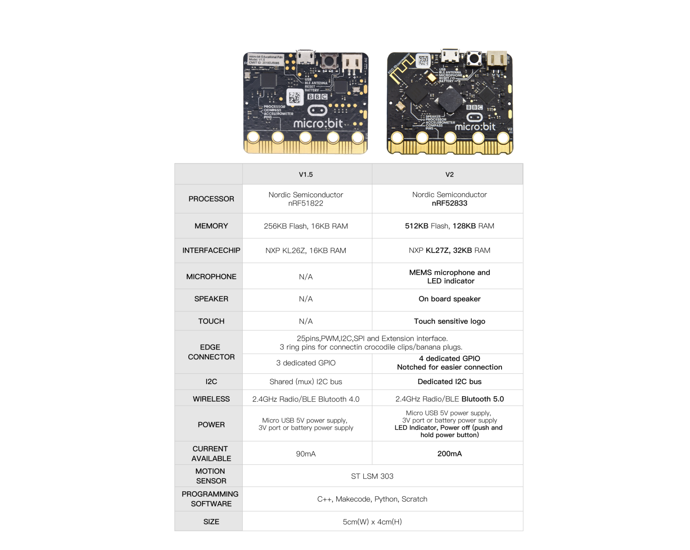

For the Micro: Bit main board V2, pressing the Reset & Power button , it will
reset the Micro: Bit and rerun the program.If you hold it tight, the red LED
will slowly get darker.When the power indicator flickers into darkness,
releasing the button and your Micro: Bit board will enter sleep mode for power
saving .This will make your battery more durable. And you could press this
button again to ‘wake up’ your Micro:bit.

For more information,please resort to following links：

<https://tech.microbit.org/hardware/>

https://microbit.org/new-microbit/

https://www.microbit.org/get-started/user-guide/overview/

<https://microbit.org/get-started/user-guide/features-in-depth/>

**( 3 ) Pinout**

Micro:bit main board V2.0 VS V1.5

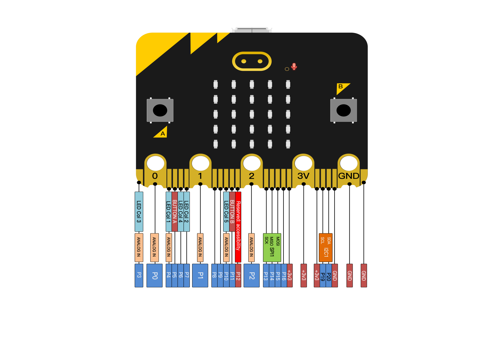

Browse the official website for more details:

<https://tech.microbit.org/hardware/edgeconnector/>

<https://microbit.org/guide/hardware/pins/>

**( 4 )Notes for the application of Micro:bit main board V2.0**

1.  It is recommended to cover it with a silicone protector to prevent short
    circuit for it has a lot of sophisticated electronic components.

2.  Its IO port is very weak in driving since it can merely handle current less
    than 300mA. Therefore, do not connect it with devices operating in large
    current,such as servo MG995 and DC motor or it will get burnt. Furthermore,
    you must figure out the current requirements of the devices before you use
    them and it is generally recommended to use the board together with a
    Micro:bit shield.

3.  It is recommended to power the main board via the USB interface or via the
    battery of 3V. The IO port of this board is 3V, so it does not support
    sensors of 5V. If you need to connect sensors of 5 V, a Micro: Bit expansion
    board is required.

d.When using pins(P3、P4、P6、P7、P10)shared with the LED dot matrix, blocking
them from the matrix or the LEDs may display randomly and the data about sensors
connected maybe wrong.

e.The battery port of 3V cannot be connected with battery more than 3.3V or the
main board will be damaged.

f. Forbid to operate it on metal products to avoid short circuit.

To put it simple, Micro:bit V2 main board is like a micro computer which has
made programming at our fingertips and enhanced digital innovation. And about
the programming environment, BBC provides a website:
<https://microbit.org/code/,> which has a graphical MakeCode program easy for
use.

1.  **Kit List**

| **Components** |                           |         |                                                              |
|----------------|---------------------------|---------|--------------------------------------------------------------|
| **\#**         | **Model**                 | **QTY** | **Picture**                                                  |
| 1              | Micro:bit Main Board V2   | 1       |   |
| 2              | Micro USB Cable           | 1       | 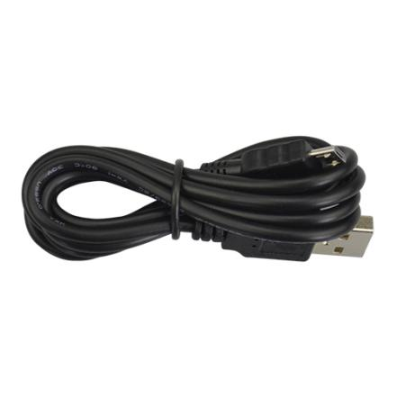            |
| 3              | Battery Holder            | 1       | 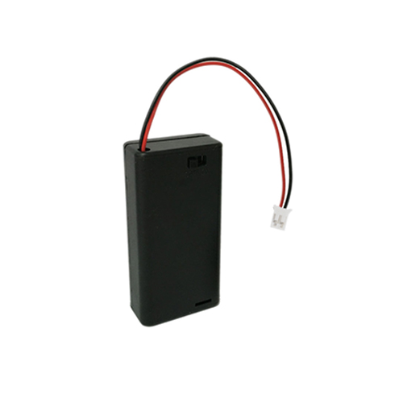            |
| 4              | Crocodile Clip            | 10      | 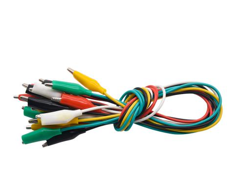            |
| 5              | Micro:bit Protective Case | 1       | 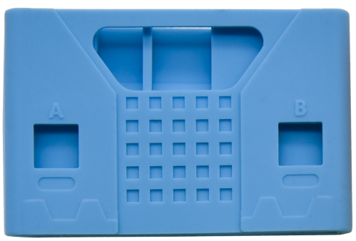      |

# 3.Install Micro:bit driver

If you have downloaded micro:bit driver, then no need to download it again.

If it is you first time to use micro:bit main board, then you will have to
download the driver.

First of all, connect the micro:bit to your computer using a USB cable.

And enter the link https://fs.keyestudio.com/KS4017

to download the driver file  of
micro:bit in file folder .

# 4.Getting Started with Micro:bit

The following instructions are applied for Windows system but can also serve as
a reference if you are using a different system.

**4.1 Write code and program**

This chapter describes how to write program with the App Micro: Bit and load the
program to the Micro: Bit main board V2.

You are recommended to browse the official website of Micro:bit for more
details, and the link is attached below:

[https://microbit.org/guide/quick/](Https://microbit.org/guide/quick/)

**Step 1: connect the Micro: Bit main board V2 with your computer**

Firstly, link the Micro: Bit main board V2 with your computer via the USB cable.
Macs, PCs, Chromebooks and Linux （including Raspberry Pi）systems are all
compatible with the Micro: Bit main board V2.

Note that if you are about to pair the board with your phone or tablet, please
refer to this link:

<https://microbit.org/get-started/user-guide/mobile/>

Secondly, if the red LED on the back of the board is on, that means the board is
powered. Then Micro: Bit main board V2 will appear on your computer as a driver
named 'MICROBIT'. Please note that it is not an ordinary USB disk as shown
below.

**Step 2: write programs**

View the link https://makecode.microbit.org/ in your browser;

Click ‘New Project’;

The dialog box‘Create a Project’ appears, fill it with ‘heartbeat’ and click
‘Create √’to edit.

(If you are running Windows 10 system, it is also viable to edit on the APP
MakeCode for micro:bit , which is exactly like editing in the website. And the
link to the APP is
https://www.microsoft.com/zh-cn/p/makecode-for-micro-bit/9pjc7sv48lcx?ocid=badgep&rtc=1&activetab=pivot:overviewtab
)

Write a set of micro:bit code. You can drag some modules in the Blocks to the
editing area and then run your program in Simulator of MakeCode editor as shown
in the picture below which demonstrates how to edit ‘heartbeat’ program .

As for loading test code , please turn to Chapter 4.5.

And introduction of Makecode is on the next chapter 4.2.

**Step 3: download test code**

If your computer is Windows 10 and you have downloaded the APP MakeCode for
micro:bit to write program, what you will have to do to download the program to
your Micro: Bit main board V2 is merely clicking the ‘Download’ button, then all
is done.

If you are writing programs through the website, following these steps:

Click the ‘Download’ in the editor to download a "hex" file, which is a compact
program format that the Micro: Bit main board can read.Once the hexadecimal file
is downloaded, copy it to your board V2 just like the process that you copy the
file to the USB driver. If you are running Windows system, you can also
right-click and select ‘Send to → Microbit (E) ‘to copy the hex file to the
Micro: Bit main board V2

You can also directly drag the "hex" file onto the MICROBIT (E) disk.

During the process of copying the downloaded hex file to the Micro: Bit main
board V2, the yellow signal light on the back side of the board flashes. When
the copy is completed, the yellow signal light will stop flashing and remain on.

**Step 4: run the program**

After the program is uploaded to the Micro: Bit main board V2, you could still
power it via the USB cable or change to via an external power. The 5 x 5 LED dot
matrix on the board displays the heartbeat pattern.

|  |
|--------------------------------------------------|--------------------------------------------------|
| Power via USB cable                              | Power via external power (3V)                    |

**Step 5：about other programming languages**

This chapter has described how to use the Micro: Bit main board V2.

But except for the Makecode graphical programming introduced you can also write
Micro: Bit programs in other languages. Go to the link:
<https://microbit.org/code/> to find more about other programming languages , or
view the link: <https://microbit.org/projects/>, to find something you want to
have a go.

**4.2 Makecode：**

Browse <https://makecode.microbit.org/> and enter Makecode online editor or open
the APP MakeCode for micro:bit of Windows 10.

Click“New Project”, and input“heartbeat”，then enter Makecode editor, as shown
below:

Please notice that blocks“on start”and“forever”are fixed in the code editing
area.

When the board is powered or reset,“on start”means that the code in this block
only executes once, while“forever”implies the code runs cyclically.

## 4.3.Quick Download

As mentioned before, if your computer is Windows 10 and you have downloaded the
APP MakeCode for micro:bit to write programs, the program written can be quickly
downloaded to the Micro: Bit main board V2 by selecting ‘Download’.

While it is a little more trickier if you are using a browser to enter makecode.
However, if you use Google Chrome, suitable for Linux，macOS and Windows 10, the
process can be quicker too.

We use the webUSB function of Chrome to allow the internet page to access the
hardware device connected USB.

You could refer to the following steps to connect and pair devices.

**Device pairing:**

Connect micro:bit to your computer by USB cable. Click“...”beside“Download”and
click“Pair device”.

Then click another“Pair device”as shown below.

Then select ‘’BBC micro:bit CMSIS-DPA” and click “Connect”. If ‘’BBC micro:bit
CMSIS-DPA”does not show up for selection, please refer to
[https://makecode.microbit.org/device/usb/webusb/troubleshoot](https://makecode.microbit.org/device/usb/webusb/troubleshoot%20)

We also provide in our resources
link <https://fs.keyestudio.com/KS4017>

What’s more, if you don’t know how to update the firmware of micro:bit, refer to
the link:
[https://microbit.org/guide/firmware/](https://microbit.org/guide/firmware/%20)
or browse folderwe provide.

Then click”Download”. The program is directly downloaded to Micro: Bit main
board V2 and the sentence “Download completed!”appears.

## 4.4 Resources and test code

Tools ,test code and other resources can be downloaded via the link
[https://fs.keyestudio.com/KS40](https://fs.keyestudio.com/KS4005-4006)17 and it
contains following files:

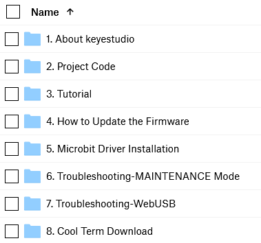

**4.5 Input test code**

We provide hexadecimal code files (project files) for each project.The file
contains all the contents of the project and can be imported directly, or you
can manually drag the code blocks to complete the program for each project. For
simple projects, dragging a block of code to complete the program is
recommended. For complex projects, it is recommended to conduct the program by
importing the hexadecimal code file we provide.

Let's take the "Heatbeat" project as an example to show how to load the code.

Open the Web version of Makecode or the Windows 10 App version of Makecode.

Click “Import File”;

Select“ ../Makecode Code/Project 1\_ Heart beat/Project 1\_ Heart beat.hex” ;

Then click “Go ahead”.

In addition to importing the test code file provided into the Makecode compiler
above, you can also drag the the test code file provided into the code editing
area of the Makecode compiler, as shown in the figure below:

After a few seconds, it is done.

Note: if your computer system is Windows7 or 8 instead of Windows 10, the
pairing cannot be done via Google Chrome. Therefore, digital signal or analog
signal of sensors and modules cannot be shown on the serial port simulator.
However, you need to read the corresponding digital signal or analog signal.So
what can we do? You can use the CoolTerm software to read the serial port data
of the micro:bit. Next chapter is about how to install CoolTerm.

## 4.6 CoolTerm Installation

CoolTerm program is used to read the data on serial port.

Download CoolTerm program:

<https://freeware.the-meiers.org/>

1.  After the download, we need to install CoolTerm program file, below is
    Window system taken as an example.

2.  Choose“win”to download the zip file of CoolTerm

3.  Unzip file and open it. (also suitable for Mac and Linux system)

（2）Double-click .

The functions of each button on the Toolbar are listed below:
<http://wiki.keyestudio.com/index.php/File:IDE.png>

|         | Opens up a new Terminal                           |
|--------------------------------------------------------|---------------------------------------------------|
|         | Opens a saved Connection                          |
|         |  Saves the current Connection to disk             |
|  | Opens the Serial Connection                       |
|  | Closes the Serial Connection                      |
|  | Clears the Received Data                          |
|  | Opens the Connection Options Dialog               |
|  | Displays the Terminal Data in Hexadecimal Format  |
|         | Displays the Help Window                          |

**5.Projects**

(Note: project 1 to 12 will be conducted with the built-in sensors and LED dot
matrix of the Micro:bit main board V2)

**Project 1: Heartbeat**

**( 1 )Project Description**

This project is easy to conduct with a micro:bit V2 main board, a Micro USB
cable and a computer. The micro:bit LED dot matrix will display a relatively big
heart-shaped pattern and then a smaller one. This alternative change of this
pattern is like heart beating. This experiment serves as a starter for your
entry to the programming world.

**( 2 )Components Needed:**

-   Micro:bit main board V2 \*1

-   Micro USB cable\*1

**( 3)Test Code:**

Attach the Micro:bit main board V2 to your computer via the Micro USB cable and
begin editing.

Firstly, click”basic”module and find and drag the block “show icon
 “ to module “forever”;

Secondly, click”basic”module again and find and drag the block “show icon
 “ to module “forever”and click
the little triangle to select “show icon
”;

Thirdly, click”basic”module and find and drag the block
“”to the code block and click the
littler triangle to select 500;

Complete Program：

Note: the“on start”means that the code in this block only executes once,
while“forever”implies that the code runs cyclically.

Click”JS JavaScript”, you will find the corresponding programming languages.

Click the little triangle”of JS JavaScript”to choose “Python”, you will find the
corresponding Python programming languages.

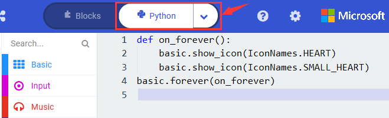

**( 4 )Test Results:**

After uploading test code to micro:bit main board V2 and keeping the connection
with the computer to power the main board, the LED dot matrix shows pattern
“”and then
“”alternatively.

( Please refer to chapter 4.3 to know how to download test code quickly.)

If the downloading is not smooth, please remove the micro USB from the main
board and then reconnect them and reopen Makecode to try again.

**Project 2: Light A Single LED**

**( 1 )Project Description:**

The LED dot matrix consists of 25 LEDs arranged in a 5 by 5 square. In order to
locate these LEDs quickly, as the figure shown below, we can regarded this
matrix as a coordinate system and create two aces by marking those in rows from
0 to 4 from top to bottom, and the ones in columns from 0 to 4 from the left to
the right. Therefore, the LED sat in the second of the first line is (1,0）and
the LED positioned in the fifth of the fourth column is (3,4）and others
likewise.

**( 2 )Components Needed:**

-   Micro:bit main board V2 \*1

-   Micro USB cable\*1

**( 3 )Test Code:**

Attach the Micro:bit main board V2 to your computer via the Micro USB cable and
begin editing.

Firstly, click”Led”module and then the”more”module to find and drag the block
“led enable false “ to block“on start”; click the little triangle of “led enable
false “ to select”true”;

Secondly, click”Led”module and to find and drag the block “toggle x 0 y 0“ to
block“forever”and alter “x0” to”x1”;

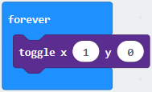

Thirdly, click”Basic”module to find and drag the block”pause(ms)100”to “forever”
block and set pause to 500;

Fourthly, copy the block  and
place it into forever” block;

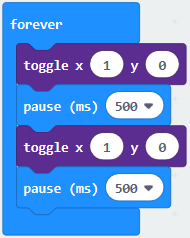

Fifthly, click”Led”module to find and drag the block”plot x 0 y 0”to “forever”
block and change the “x 0 y 0” to “x 3 y 4”;

Sixthly, copy the block “pause(ms)500” and place it into forever” block;

Lastly, click”Led”module to find and drag the block”unplot x 0 y 0”to “forever”
block and change “x 0 y 0” to “x 3 y 4”;and copy and place the
block“pause(ms)500”to block “forever”;

Complete Program：

Click”JS JavaScript”, you will find the corresponding programming languages.

Click the little triangle”of JS JavaScript”to choose “Python”, you will find the
corresponding Python programming languages.

**( 4)Test Results**

After uploading test code to micro:bit main board V2 and powering the main board
via the USB cable, the LED in (1,0) lights up for 0.5s and the one in (3,4)
shines for 0.5s and repeat this sequence.

**Project 3: LED Dot Matrix**

**( 1 )Project Description:**

Dot matrices are very commonplace in daily life. They have found wide
applications in LED advertisement screens, elevator floor display, bus stop
announcement and so on.

The LED dot matrix of Micro: Bit main board V2 contains 25 LEDs in a grid.
Previously, we have succeeded in controlling a certain LED to light by
integrating its position value into the test code. Supported by the same theory,
we can turn on many LEDs at the same time to showcase patterns, digits and
characters.

What’s more, we can also click”show icon“ to choose the pattern we like to
display. Last but not the least, we can design patterns by ourselves.

**( 2 )Components Needed:**

-   Micro:bit main board V2 \*1

-   Micro USB cable\*1

**( 3 )Test Code 1：**

Link computer with micro:bit board by micro USB cable, and program in MakeCode
editor.

1.  A. Enter“Led”→“more”→“led enable false”

2.  Click the drop-down triangle button to select“true”
    

3.  Combine it with “on start” block

\*\*\*\*\*\*\*\*\*\*\*\*\*\*\*\*\*\*\*\*\*\*\*\*\*\*\*\*\*\*\*\*\*\*\*\*\*\*\*\*\*\*\*\*\*\*\*\*\*\*\*\*\*\*\*\*\*\*\*\*\*\*\*\*\*

1.  Click“Led”to move“plot x 0 y 0”into“forever”，then replicate“plot x 0 y
    0”for 8 times, respectively set to“x 2”y 0”,“x 2”y 1”,“x 2”y 2”,“x 2”y 3”,“x
    2”y 4”,“x 1”y 3”“x 0”y 2”,“x 3”y 3”,“x 4”y 2”.

Complete Program：

|  |
|-------------------------------------------------|
|                                                 |

Select“JavaScript" and“Python”to switch into JavaScript and Python language
code:

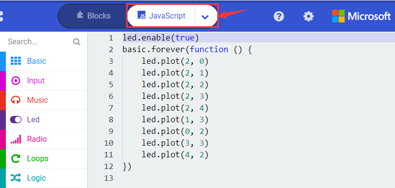

**( 4 )Test Results 1：**

Upload code 1 and power the board , we will see the icon

**( 5 ) Test Code 2：**

Link computer with micro:bit board by micro USB cable, and program in MakeCode
editor.

1.  A. Enter“Basic”→“show number 0”block,

2.  Duplicate it for 4 times, then separately set to“show number 1”,“show number
    2”,“show number 3”,“show number 4”,“show number 5”.

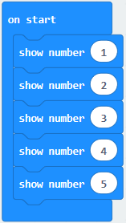

\*\*\*\*\*\*\*\*\*\*\*\*\*\*\*\*\*\*\*\*\*\*\*\*\*\*\*\*\*\*\*\*\*\*\*\*\*\*\*\*\*\*\*\*\*\*\*\*\*\*\*\*\*\*\*\*\*\*\*\*\*\*\*\*\*

1.  Click“Basic”→“show leds”, then put it into“forever”block，tick blue boxes to
    light LED and generate“↓”pattern.

    

\*\*\*\*\*\*\*\*\*\*\*\*\*\*\*\*\*\*\*\*\*\*\*\*\*\*\*\*\*\*\*\*\*\*\*\*\*\*\*\*\*\*\*\*\*\*\*\*\*\*\*\*\*\*\*\*\*\*\*\*\*\*\*\*\*

1.  Move out the block“show string” from“Basic”block, and leave it beneath
    the“show leds” block

    

Choose“show icon”from“Basic”block, and leave it beneath the block“show
string“Hello!”block

\*\*\*\*\*\*\*\*\*\*\*\*\*\*\*\*\*\*\*\*\*\*\*\*\*\*\*\*\*\*\*\*\*\*\*\*\*\*\*\*\*\*\*\*\*\*\*\*\*\*\*\*\*\*\*\*\*\*\*\*\*\*\*\*\*

1.  A. Enter“Basic”→“show arrow North”;

B. Leave it into“forever”block，replicate“show arrow North”for 3
times，respectively set to“North East”,“South East”, “South West”,“North West”.

1.  Click“Basic”to get block“clear screen”then remain it below the block “show
    arrow North West”

\*\*\*\*\*\*\*\*\*\*\*\*\*\*\*\*\*\*\*\*\*\*\*\*\*\*\*\*\*\*\*\*\*\*\*\*\*\*\*\*\*\*\*\*\*\*\*\*\*\*\*\*\*\*\*\*\*\*\*\*\*\*\*\*\*

(5) Drag“pause (ms) 100”block from“Basic”block and set to 500ms, then leave it
below“clear screen”block.

Complete Program:

|   |
|--------------------------------------------------|
|                                                  |

Select“JavaScript" and“Python”to switch into JavaScript and Python language
code:

**( 6 )Test Results 2：**

Upload code 2 and plug micro:bit in power, Micro: bit starts showing number 1,
2, 3, 4, and 5, then cyclically
display,“Hello!”,
,
,
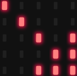,
 and
patterns.

**Project 4: Programmable Buttons**

**( 1 )Project Description:**

Buttons can be used to control circuits. In an integrated circuit with a button,
the circuit is connected when pressing the button and it is open the other way
around.

Micro: Bit main board V2 boasts three buttons, two are programmable
buttons(marked with A and B), and the one on the other side is a reset button.
By pressing the two programmable buttons can input three different signals. We
can press button A or B alone or press them together and the LED dot matrix
shows A,B and AB respectively. Let’s get started.

**( 2 )Components Needed:**

-   Micro:bit main board V2 \*1

-   Micro USB cable\*1

**( 3 )Test Code 1：**

Link computer with micro:bit board by micro USB cable, and program in MakeCode
editor,

1.  Delete“on start”and“forever”firstly，then click“Input”→“on button A pressed”

\*\*\*\*\*\*\*\*\*\*\*\*\*\*\*\*\*\*\*\*\*\*\*\*\*\*\*\*\*\*\*\*\*\*\*\*\*\*\*\*\*\*\*\*\*\*\*\*\*\*\*\*\*\*\*\*\*\*\*\*\*\*\*\*\*

1.  A. Click“Basic”→“show string”;

B. Then place it into“on button A pressed”block, change
“Hello!”into“A”.

1.  Copy code stringonce, tap the
    drop-down button“A”to select“B”and modify
    character“A”into“B”.

\*\*\*\*\*\*\*\*\*\*\*\*\*\*\*\*\*\*\*\*\*\*\*\*\*\*\*\*\*\*\*\*\*\*\*\*\*\*\*\*\*\*\*\*\*\*\*\*\*\*\*\*\*\*\*\*\*\*\*\*\*\*\*\*\*

1.  Copyonce，and set to“on
    button A+B pressed”and“show string “AB”

\*\*\*\*\*\*\*\*\*\*\*\*\*\*\*\*\*\*\*\*\*\*\*\*\*\*\*\*\*\*\*\*\*\*\*\*\*\*\*\*\*\*\*\*\*\*\*\*\*\*\*\*\*\*\*\*\*\*\*\*\*\*\*\*\*

Complete Code:

|  |
|-------------------------------------------------|
|                                                 |

Select“JavaScript" and“Python”to switch into JavaScript and Python language
code:

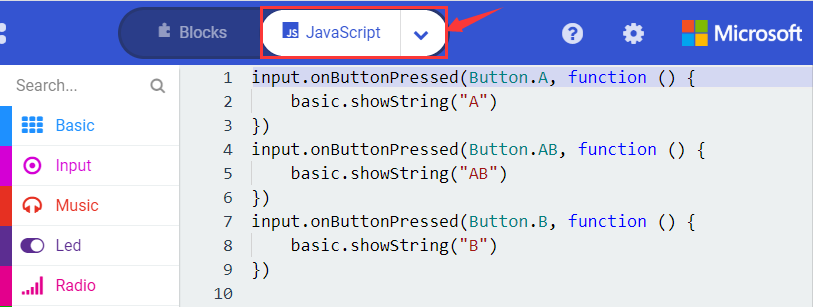

**( 4 )Test Results 1：**

After uploading test code 1 to micro:bit main board V2 and powering the main
board via the USB cable, the 5\*5 LED dot matrix shows A if button A is pressed,
B if button B pressed, and AB if button A and B pressed together.

**( 5 ) Test Code 2：**

1.  A. Click“Led”→“more”→“led enable false”,

B. Put it into the block“on start”，click drop-down triangle button to
select“true” .

\*\*\*\*\*\*\*\*\*\*\*\*\*\*\*\*\*\*\*\*\*\*\*\*\*\*\*\*\*\*\*\*\*\*\*\*\*\*\*\*\*\*\*\*\*\*\*\*\*\*\*\*\*\*\*\*\*\*\*\*\*\*\*\*\*

1.  A. Tap“Variables”→“Make a Variable...”→“New variable name：”

B. Enter“item”in the dialog box and click“OK”，then variable“item”is produced.
And move“set item to 0”into“on start”block

\*\*\*\*\*\*\*\*\*\*\*\*\*\*\*\*\*\*\*\*\*\*\*\*\*\*\*\*\*\*\*\*\*\*\*\*\*\*\*\*\*\*\*\*\*\*\*\*\*\*\*\*\*\*\*\*\*\*\*\*\*\*\*\*\*

1.  A. Click“Input”→“on button A pressed”.

B. Go to“Variables”→“ change item by 1 ”

C. Place it into“on button A pressed”and 1 is modified into
5.

\*\*\*\*\*\*\*\*\*\*\*\*\*\*\*\*\*\*\*\*\*\*\*\*\*\*\*\*\*\*\*\*\*\*\*\*\*\*\*\*\*\*\*\*\*\*\*\*\*\*\*\*\*\*\*\*\*\*\*\*\*\*\*\*\*

1.  Duplicatecode string
    once，click the drop-down button to select“B”，then set“change item by
    \-5”.

\*\*\*\*\*\*\*\*\*\*\*\*\*\*\*\*\*\*\*\*\*\*\*\*\*\*\*\*\*\*\*\*\*\*\*\*\*\*\*\*\*\*\*\*\*\*\*\*\*\*\*\*\*\*\*\*\*\*\*\*\*\*\*\*\*

1.  A. Enter“Led”→“plot bar graph of 0 up to 0”

B. Keep it into“forever”block

C. Go to“Variables”to move“item”into 0 box，change 0 into 25.

\*\*\*\*\*\*\*\*\*\*\*\*\*\*\*\*\*\*\*\*\*\*\*\*\*\*\*\*\*\*\*\*\*\*\*\*\*\*\*\*\*\*\*\*\*\*\*\*\*\*\*\*\*\*\*\*\*\*\*\*\*\*\*\*\*

(6)A. Go to“Logic”to move out “if...true...then...”and “=”blocks，

B. Keep“=”into“true”box and set to “\>”

C. Select“item”in the“Variables”and lay it down at left box of “\>”，change 0
into 25；

D. Enter“Variables”to drag“set item to 0”block into“if...true..then...”, alter 0
into 25.

\*\*\*\*\*\*\*\*\*\*\*\*\*\*\*\*\*\*\*\*\*\*\*\*\*\*\*\*\*\*\*\*\*\*\*\*\*\*\*\*\*\*\*\*\*\*\*\*\*\*\*\*\*\*\*\*\*\*\*\*\*\*\*\*\*

(7) A. Replicate code stringonce

B.“\>” is modified into “\<” and 25 is changed into 0,

C. Leave it beneath code string.

Complete Program：

|  |
|-------------------------------------------------|
|                                                 |

Select“JavaScript" and“Python”to switch into JavaScript and Python language
code:

**( 6 )Test Results 2：**

After uploading test code 2 to micro:bit main board V2 and powering the main
board via the USB cable, when pressing the button A the LEDs turning red
increase while when pressing the button B the LEDs turning red reduce.

**Project 5: Temperature Detection**

**( 1 )Project Description:**

The Micro:bit main board V2 is not equipped with a temperature sensor, but uses
the temperature sensor built into NFR52833 chip for temperature detection.
Therefore, the detected temperature is more closer to the temperature of the
chip, and there maybe deviation from the ambient temperature.

**( 2 )Components Needed:**

-   Micro:bit main board V2 \*1

-   Micro USB cable\*

**( 3 )Test Code 1：**

1.  Click“Advanced”→”Serial”→“serial redirect to USB”into“on start”

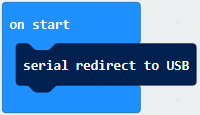

\*\*\*\*\*\*\*\*\*\*\*\*\*\*\*\*\*\*\*\*\*\*\*\*\*\*\*\*\*\*\*\*\*\*\*\*\*\*\*\*\*\*\*\*\*\*\*\*\*\*\*\*\*\*\*\*\*\*\*\*\*\*\*\*\*

1.  A. Go to“Serial”→“serial write value“x”=0”into “forever”

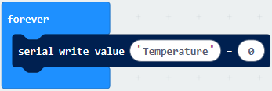

1.  Click“Input” → “temperature(℃)” into“into serial write value“x”=0 and
    change”0”into “temperature”

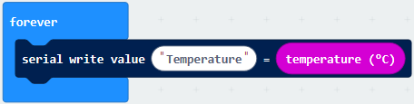

\*\*\*\*\*\*\*\*\*\*\*\*\*\*\*\*\*\*\*\*\*\*\*\*\*\*\*\*\*\*\*\*\*\*\*\*\*\*\*\*\*\*\*\*\*\*\*\*\*\*\*\*\*\*\*\*\*\*\*\*\*\*\*\*\*

1.  Go to“Basic”→“pause (ms) 100”into “forever”and set pause to 500

\*\*\*\*\*\*\*\*\*\*\*\*\*\*\*\*\*\*\*\*\*\*\*\*\*\*\*\*\*\*\*\*\*\*\*\*\*\*\*\*\*\*\*\*\*\*\*\*\*\*\*\*\*\*\*\*\*\*\*\*\*\*\*\*\*

Complete Program：

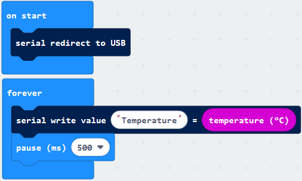

Select“JavaScript" and“Python”to switch into JavaScript and Python language
code:

**( 4 )Test Results 1：**

After uploading test code 1 to micro:bit main board V2, powering the main board
via the USB cable, and clicking “Show console Device”, the data of temperature
shows in the serial monitor page as shown below.

If you're running Windows 7 or 8 instead of Windows 10, via Google Chrome won't
be able to match devices. You'll need to use the CoolTerm serial monitor
software to read data.

You could open CoolTerm software, click Options, select SerialPort, set COM port
and put baud rate to 115200 (after testing, the baud rate of USB SerialPort
communication on Micro: Bit main board V2 is 115200), click OK, and Connect. The
CoolTerm serial monitor shows the change of temperature in the current
environment, as shown in the figures below :

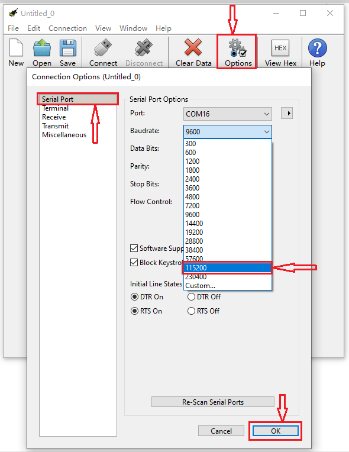

**( 5 )Test Code 2：**

Link computer with micro:bit board by micro USB cable, and program in MakeCode
editor,

1.  A. Go to“Led”→“more”→“led enable false”block,

B. Keep it into the“on start”block，tap the triangle button to
select“true”.

\*\*\*\*\*\*\*\*\*\*\*\*\*\*\*\*\*\*\*\*\*\*\*\*\*\*\*\*\*\*\*\*\*\*\*\*\*\*\*\*\*\*\*\*\*\*\*\*\*\*\*\*\*\*\*\*\*\*\*\*\*\*\*\*\*

1.  Tap“Logic”and drag“if...then...else”into“forever”block; and then drag “=”
    into “true”

1.  Enter“Input”to move“temperature(℃)”into the left side of “=”; click the
    little triangle of “=”to choose “≥”,and change the “0”to “35”

1.  Click“Basic”to find out block“show icon”and move it into“then”; copy and
    place the block“show icon”to “else”and click the little triangle of
    “”to select
    “”

Complete Program：

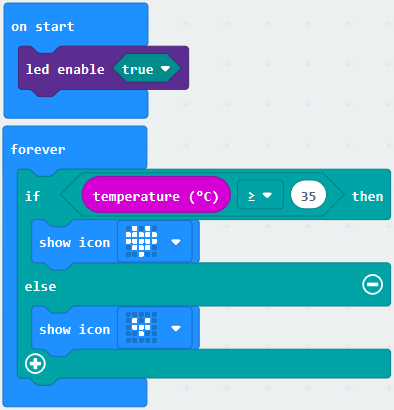

Select“JavaScript" and“Python”to switch into JavaScript and Python language
code:

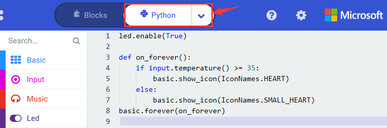

**( 6 )Test Results 2：**

After uploading the code 2, when the ambient temperature is less than 35℃, the
5\*5 LED dot matrix shows . When
the temperature is equivalent to or greater than 35℃, the
pattern appears.

**Project 6: Geomagnetic Sensor**

**( 1 )Project Description:**

This project aims to explain the use of the Micro: bit geomagnetic sensor, which
can not only detect the strength of the geomagnetic field, but also be used as a
compass to find bearings. It is also an important part of the Attitude and
Heading Reference System (AHRS). Micro: Bit main board V2 uses LSM303AGR
geomagnetic sensor, and the dynamic range of magnetic field is ±50 gauss. In the
board, the magnetometer module is used in both magnetic detection and compass.
In this experiment, the compass will be introduced first, and then the original
data of the magnetometer will be checked.The main component of a common compass
is a magnetic needle, which can be rotated by the geomagnetic field and point
toward the geomagnetic North Pole (which is near the geographic South Pole) to
determine direction.

**( 2 )Components Needed:**

-   Micro:bit main board V2 \*1

-   Micro USB cable\*1

**( 3 )Test Code 1：**

Link computer with micro:bit board by micro USB cable, and program in MakeCode
editor.

1.  A. Click“Input”→“more”→“calibrate compass”

B. Lay down it into block“on start”.

1.  A. Go to“Input”→“on button A pressed”.

B. Enter“Basic”→“show number”, put it into“on button A pressed”block;

C. Tap“Input”→“compass heading(℃)”， and place it into“show number”

\*\*\*\*\*\*\*\*\*\*\*\*\*\*\*\*\*\*\*\*\*\*\*\*\*\*\*\*\*\*\*\*\*\*\*\*\*\*\*\*\*\*\*\*\*\*\*\*\*\*\*\*\*\*\*\*\*\*\*\*\*\*\*\*\*

Complete Program：

|  |
|------------------------------------------------------|
|                                                      |

Select“JavaScript" and“Python”to switch into JavaScript and Python language
code:

**( 4 )Test Results 1：**

After uploading test code to micro:bit main board V2 and powering the board via
the USB cable, and pressing the button A, the board asks us to calibrate compass
and the LED dot matrix shows “TILT TO FILL SCREEN”. Then enter the calibration
page. Rotate the board until all 25 LEDs are on red as shown below.

After that, a smile pattern
 appears, which implies
the calibration is done. When the calibration process is completed, pressing the
button A will make the magnetometer reading display directly on the screen. And
the direction north, east, south and west correspond to 0°, 90°, 180° and 270°
respectively.

**( 5 ) Test Code 2：**

This module can keep reading data to determine direction, so does point to the
current magnetic North Pole by arrow.

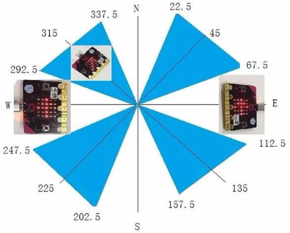

For the above picture, the arrow pointing to the upper right when the value
ranges from 292.5 to 337.5. Because 0.5 can’t be input in the code, the values
we get are 293 and 338.

Link computer with micro:bit board by micro USB cable, and program in MakeCode
editor,

1.  

2.  Enter“Input”→ “more”→“calibrate compass”

3.  Move“calibrate compass”into“on start”

\*\*\*\*\*\*\*\*\*\*\*\*\*\*\*\*\*\*\*\*\*\*\*\*\*\*\*\*\*\*\*\*\*\*\*\*\*\*\*\*\*\*\*\*\*\*\*\*\*\*\*\*\*\*\*\*\*\*\*\*\*\*\*\*\*

1.  A. Click“Variables”→“Make a Variable...”→“New variable name：”

B. Input“x”in the blank box and click“OK”, and the variable “x” is generated.

C. Drag out“set x to”into“forever”block

1.  A. Go to“Input”→“compass heading(℃)”, and keep it into“0”box

1.  Tap“Logic”→“if...then...else”, leave it below block“sex x to compass
    heading”, then clickicon for
    6 times.

\*\*\*\*\*\*\*\*\*\*\*\*\*\*\*\*\*\*\*\*\*\*\*\*\*\*\*\*\*\*\*\*\*\*\*\*\*\*\*\*\*\*\*\*\*\*\*\*\*\*\*\*\*\*\*\*\*\*\*\*\*\*\*\*\*

1.  A. Place“and”into“true”block

B. Then move“=”block to the left box of “and”

C. Click“Variables”to drag“x”to the left “0”box, change 0 into 293 and set to
“≥”;

D. Then copy“x≥293”once and leave it to the right “0”box and set to“x\<338”

\*\*\*\*\*\*\*\*\*\*\*\*\*\*\*\*\*\*\*\*\*\*\*\*\*\*\*\*\*\*\*\*\*\*\*\*\*\*\*\*\*\*\*\*\*\*\*\*\*\*\*\*\*\*\*\*\*\*\*\*\*\*\*\*\*

1.  A. Go to“Basic”→“show leds”

B. Lay it down beneath block,
then click“show leds”and the pattern
appears.

1.  A. Duplicate for 6 times.

B. Separately leave them into the blank boxes behind “else if”.

C. Set to“x≥23 and x\<68”,“x≥68 and x\<113 ”,“x≥113 and x\<158 ”,“x≥158 and
x\<203 ”,“x≥203 and x\<248 ”,“x≥248 and x\<293 ”respectively.

D. Then copy “show leds”for 7 times and keep them below the “else if.......then”
block respectively.

E. Click the blue boxes to form the
pattern“”,
“”,
“”,
“”,
“”,
“”and
“”.

\*\*\*\*\*\*\*\*\*\*\*\*\*\*\*\*\*\*\*\*\*\*\*\*\*\*\*\*\*\*\*\*\*\*\*\*\*\*\*\*\*\*\*\*\*\*\*\*\*\*\*\*\*\*\*\*\*\*\*\*\*\*\*\*\*\*\*\*\*\*\*\*\*\*\*\*\*

Complete Program：

| pattern appears       |
|------------------------------------------------------------------------------------------------------------------------------------------------------------------------------------------------------------------------------------------------------------------------------------------------------------------------------------------------------------------------------------------------------------------------------------------------------------------------------------------------------------------------------------------------------------------------------------------------------------------------------------------------------------------------------------------------------------------------------------------------------------------------------------------------------------------------------------------------------------------------------------------------------------------------------------------------------------------------------------------------------------------------------------------------------------------------------------------------------------------------------------------------------------------------------------------------------------------------|
|  When x is not among the above rang, the next program will be executed under else block                                                                                                                                                                                                                                                                                                                        |

Select“JavaScript" and“Python”to switch into JavaScript and Python language
code:

**( 6 ) Test Results 2**

Upload code 2 and plug micro:bit into power. After calibration, tilt micro:bit
board, and the LED dot matrix displays the direction signs.

**Project 7: Accelerometer**

**( 1 )Project Description:**

The Micro: Bit main board V2 has a built-in LSM303AGR gravity acceleration
sensor, also known as accelerometer, with a resolution of 8/10/12 bits. The code
section sets the range to 1g, 2g, 4g, and 8g.

We often use accelerometer to detect the status of machines.

In this project, we will introduce how to measure the position of the board with
the accelerometer. And then have a look at the original three-axis data output
by the accelerometer.

**( 2 )Components Needed:**

-   Micro:bit main board V2 \*1

-   Micro USB cable\*1

**( 3 )Test Code 1：**

Link computer with micro:bit board by micro USB cable, and program in MakeCode
editor,

(1) A. Enter“Input”→“on shake”，

B. Click“Basic”→“show number”, place it into“on shake”block, then change 0 into
1.

\*\*\*\*\*\*\*\*\*\*\*\*\*\*\*\*\*\*\*\*\*\*\*\*\*\*\*\*\*\*\*\*\*\*\*\*\*\*\*\*\*\*\*\*\*\*\*\*\*\*\*\*\*\*\*\*\*\*\*\*\*\*\*\*\*

(2) A. Copy code string for 7
times;

1.  separately click the triangle button to select“logo up”,“logo down”,“screen
    up”,“screen down”,“tilt left”,“tilt right”and“free fall”, then respectively
    change 1 into 2, 3, 4, 5, 6, 7, 8.

\*\*\*\*\*\*\*\*\*\*\*\*\*\*\*\*\*\*\*\*\*\*\*\*\*\*\*\*\*\*\*\*\*\*\*\*\*\*\*\*\*\*\*\*\*\*\*\*\*\*\*\*\*\*\*\*\*\*\*\*\*\*\*\*\*

Complete Program：

|  |
|--------------------------------------------------------|
|                                                        |

|  |
|-------------------------------------------------|
|                                                 |

Select“JavaScript" and“Python”to switch into JavaScript and Python language
code:

**( 4 )Test Results 1:**

After uploading the test code 1 to micro:bit main board V2 and powering the
board via the USB cable, if we shake the Micro: Bit main board V2. no matter at
any direction, the LED dot matrix displays the digit “1”.

When it is kept upright （make its logo above the LED dot matrix）, the number 2
shows.

When it is kept upside down( make its logo below the LED dot matrix) , it shows
as below.

When it is placed still on the desk, showing its front side, the number 4
appears.

When it is placed still on the desk, showing its back side, the number 5
exhibits.

When the board is tilted to the left , the LED dot matrix shows the number 6 as
shown below.

When the board is tilted to the right , the LED dot matrix displays the number 7
as shown below

When the board is knocked to the floor, this process can be considered as a free
fall and the LED dot matrix shows the number 8. (please note that this test is
not recommended for it may damage the main board.)

Attention: if you’d like to try this function, you can also set the acceleration
to 3g, 6g or 8g. But still ,we do not recommend.

**( 5 )Test Code 2：**

1.  A. Go to“Advanced”→“Serial”→“serial redirect to USB”

B. Drag it into“on start”

\*\*\*\*\*\*\*\*\*\*\*\*\*\*\*\*\*\*\*\*\*\*\*\*\*\*\*\*\*\*\*\*\*\*\*\*\*\*\*\*\*\*\*\*\*\*\*\*\*\*\*\*\*\*\*\*\*\*\*\*\*\*\*\*\*

1.  A. Enter“Serial”→“serial write value x =0”

B. Leave it into“forever”block

\*\*\*\*\*\*\*\*\*\*\*\*\*\*\*\*\*\*\*\*\*\*\*\*\*\*\*\*\*\*\*\*\*\*\*\*\*\*\*\*\*\*\*\*\*\*\*\*\*\*\*\*\*\*\*\*\*\*\*\*\*\*\*\*\*

1.  A. Click“Input”→“acceleration(mg) x”；

B. Keep it into“0”box and capitalize the“x”

\*\*\*\*\*\*\*\*\*\*\*\*\*\*\*\*\*\*\*\*\*\*\*\*\*\*\*\*\*\*\*\*\*\*\*\*\*\*\*\*\*\*\*\*\*\*\*\*\*\*\*\*\*\*\*\*\*\*\*\*\*\*\*\*\*

1.  Go to“Basic”and move out“pause (ms) 100”below the
    block, then set to 100ms.

    

\*\*\*\*\*\*\*\*\*\*\*\*\*\*\*\*\*\*\*\*\*\*\*\*\*\*\*\*\*\*\*\*\*\*\*\*\*\*\*\*\*\*\*\*\*\*\*\*\*\*\*\*\*\*\*\*\*\*\*\*\*\*\*\*\*

1.  Replicate code string

for 3 times and keep them into“forever”block，separately set the whole code
string as follows:

Complete Program：

|    |
|---------------------------------------------------|
|                                                   |

Select“JavaScript" and“Python”to switch into JavaScript and Python language
code:

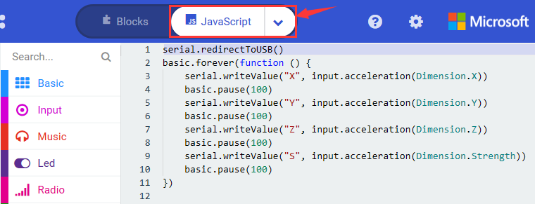

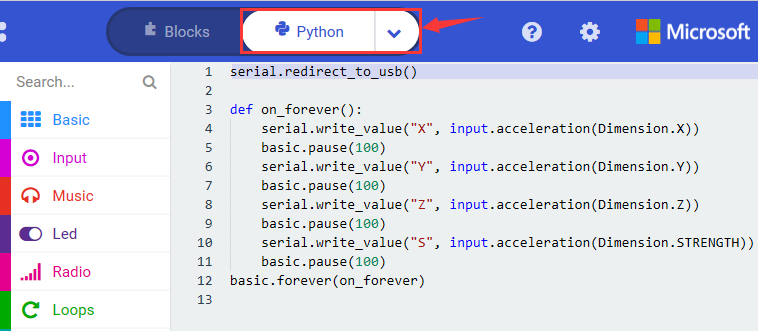

**( 6 ) Test Results 2**

Upload test code to micro:bit main board V2, power the main board via the USB
cable, and click “Show console Device”.

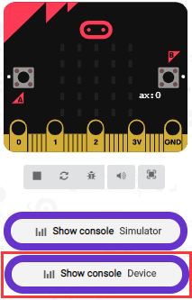

After referring to the MMA8653FC data manual and the hardware schematic diagram
of the Micro: Bit main board V2, the accelerometer coordinate of the Micro: Bit
V2 motherboard are shown in the figure below:

The following interface shows the decomposition value of acceleration in X axis,
Y axis and Z axis respectively, as well as acceleration synthesis (acceleration
synthesis of gravity and other external forces).

If you're running Windows 7 or 8 instead of Windows 10, via Google Chrome won't
be able to match devices. You'll need to use the CoolTerm serial monitor
software to read data.

You could open CoolTerm software, click Options, select SerialPort, set COM port
and put baud rate to 115200 (after testing, the baud rate of USB SerialPort
communication on Micro: Bit main board V2 is 115200), click OK, and Connect. The
CoolTerm serial monitor shows the data of X axis, Y axis and Z axis , as shown
in the figures below :

**Project 8: Light Detection**

**( 1 )Project Description:**

In this project, we focus on the light detection function of the Micro: Bit main
board V2. It is achieved by the LED dot matrix since the main board is not
equipped with a photoresistor.

**( 2 )Components Needed:**

-   Micro:bit main board V2 \*1

-   Micro USB cable\*1

**( 3 )Test Code：**

Link computer with micro:bit board by micro USB cable, and program in MakeCode
editor,

(1)A. Enter“Advanced”→“Serial”→“serial redirect to USB”;

B. Drag it into“on start”block.

\*\*\*\*\*\*\*\*\*\*\*\*\*\*\*\*\*\*\*\*\*\*\*\*\*\*\*\*\*\*\*\*\*\*\*\*\*\*\*\*\*\*\*\*\*\*\*\*\*\*\*\*\*\*\*\*\*\*\*\*\*\*\*\*\*

(2) A. Go to“Serial”→“serial write value x =0”;

B. Move it into“forever”

1.  A. Click“Input”→“acceleration(mg) x”

B. Put“acceleration(mg) x”in the“0”box and change “x”into“Light intensity”.

\*\*\*\*\*\*\*\*\*\*\*\*\*\*\*\*\*\*\*\*\*\*\*\*\*\*\*\*\*\*\*\*\*\*\*\*\*\*\*\*\*\*\*\*\*\*\*\*\*\*\*\*\*\*\*\*\*\*\*\*\*\*\*\*\*

1.  A. Click“Basic”→“pause (ms) 100”;

B. Lay it down into“forever”and set to 100ms.

\*\*\*\*\*\*\*\*\*\*\*\*\*\*\*\*\*\*\*\*\*\*\*\*\*\*\*\*\*\*\*\*\*\*\*\*\*\*\*\*\*\*\*\*\*\*\*\*\*\*\*\*\*\*\*\*\*\*\*\*\*\*\*\*\*

Complete Program：

|  |
|-------------------------------------------------|
|                                                 |

Select“JavaScript" and“Python”to switch into JavaScript and Python language
code:

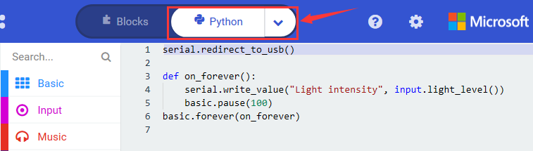

**( 4 )Test Results:**

Upload the test code to micro:bit main board V2, power the board via the USB
cable and click “Show console Device”.

When the LED dot matrix is covered by hand, the light intensity showed is
approximately 0; when the LED dot matrix is exposed to light,the light intensity
displayed gets stronger with the light as shown below.

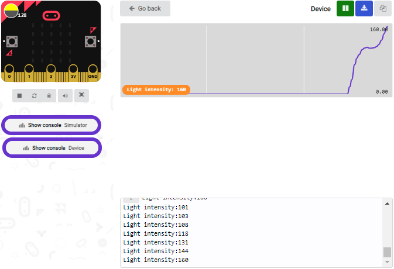

If you're running Windows 7 or 8 instead of Windows 10, via Google Chrome won't
be able to match devices. You'll need to use the CoolTerm serial monitor
software to read data.

You could open CoolTerm software, click Options, select SerialPort, set COM port
and put baud rate to 115200 (after testing, the baud rate of USB SerialPort
communication on Micro: Bit main board V2 is 115200), click OK, and Connect. The
CoolTerm serial monitor shows the value of light intensity , as shown in the
figures below :

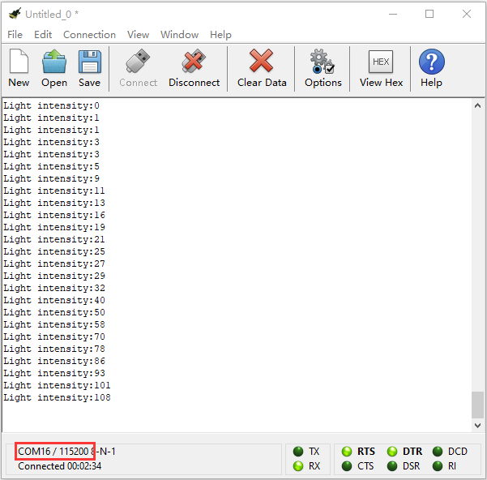

**Project 9: Speaker**

**( 1 )Project Description:**

The Micro: Bit main board V2 has an built-in speaker, which makes adding sound
to the programs easier. We can program the speaker to air all kinds of tones,
like playing the son *Ode to Joy.*

**( 2 )Components Needed:**

-   Micro:bit main board V2 \*1

-   Micro USB cable\*1

**( 3 )Test Code：**

Link computer with micro:bit board by micro USB cable, and program in MakeCode
editor,

Enter“Basic”module to find “show icon”and drag it into “on start”block;

Click the little triangle to
find“”

\*\*\*\*\*\*\*\*\*\*\*\*\*\*\*\*\*\*\*\*\*\*\*\*\*\*\*\*\*\*\*\*\*\*\*\*\*\*\*\*\*\*\*\*\*\*\*\*\*\*\*\*\*\*\*\*\*\*\*\*\*\*\*\*\*

Enter“Music”module to find and drug“play sound giggle until done” into
“forever”block;

Enter“Basic”module to find and drug“pause(ms) 100” into “forever” block ;

Change 100 into 1000;

Copy  three times and place it
into “forever” block ;

Click the little triangle to select “happy”,”hello”,”yawn”;

\*\*\*\*\*\*\*\*\*\*\*\*\*\*\*\*\*\*\*\*\*\*\*\*\*\*\*\*\*\*\*\*\*\*\*\*\*\*\*\*\*\*\*\*\*\*\*\*\*\*\*\*\*\*

Complete Program：

Select“JavaScript" and“Python”to switch into JavaScript and Python language
code:

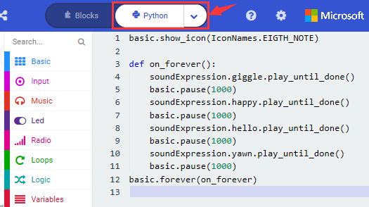

**( 4 )Test Results:**

After uploading the test code to micro:bit main board V2 and powering the board
via the USB cable, the speaker utters sound and the LED dot matrix shows the
logo of music.

**Project 10: Touch-sensitive Logo**

**( 1 )Project Description:**

The Micro: Bit main board V2 is equipped with a golden touch-sensitive logo,
which can act as an input component and function like an extra button.

It contains a capacitive touch sensor that senses small changes in the electric
field when pressed (or touched), just like your phone or tablet screen do.When
you press it , you can activate the program.

**( 2 )Components Needed:**

-   Micro:bit main board V2 \*1

-   Micro USB cable\*1

**( 3 )Test Code：**

Link computer with micro:bit board by micro USB cable, and program in MakeCode
editor,

Delete block“on start”and“forever”;

Enter“Input”module to find and drag“on logo pressed” ;

Click the little triangle to find “touched”’;

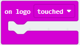

Enter module “Variables”→choose“Make a Variable”→input “start”→click “OK”

The variable“start”is established;

Enter“Variables”module to find and drag “set start to 0” into “on logo
touched”block;

Enter“Input”module →click “more”→ find and drag“running time(ms)” into the
“0”of“set start to 0”block;

Enter“Basic”module to find and drag“show
icon” into “on logo
touched”block;

Enter“Input”module to find and drag“on logo pressed”→choose “released”→
establish variable “time”;

Enter“Variables”module to find and drag “set time to 0”into “on logo
pressed”block;

Enter“Math”module to find and drag “0-0”into the “0”of“set start to 0”block;

Enter“Input”module→ “more” → find and drag “running time(ms)” into “0”on the
left side of “0-0”;

Enter“Variables”module to find and drag“start” into “0”on the right side of
“0-0”;

Enter“Basic”module to find and drag“show number” into “on logo released”block;

Enter“Math”module to find and drag“square root 0” into “0”; Click the little
triangle to find”integer÷”;

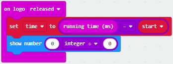

Enter“Variables”module to find and drag“time” into “0”on the left side of
“0-0”and change the “0”on the right side to”1000”;

Complete Program：

Select“JavaScript" and“Python”to switch into JavaScript and Python language
code:

**( 4 )Test Results:**

After uploading the test code to micro:bit main board V2 and powering the board
via the USB cable, the LED dot matrix exhibits the heart pattern when the
touch-sensitive logo is pressed or touched and displays digit when the logo is
released.

**Project 11: Microphone**

**( 1 )Project Description:**

The Micro: Bit main board V2 is built with a microphone which can test the
volume of ambient environment. When you clap, the microphone LED indicator turns
on. Since it can measure the intensity of sound, you can make a noise scale or
disco lighting changing with music. The microphone is placed on the opposite
side of the microphone LED indicator and in proximity with holes that lets sound
pass.When the board detects sound, the LED indicator lights up.

**( 2 )Components Needed:**

-   Micro:bit main board V2 \*1

-   Micro USB cable\*1

**( 3 )Test Code 1：**

Link computer with micro:bit board by micro USB cable, and program in MakeCode
editor,

Delete block“on start”and“forever”;

Enter“Input”module to find and drag“on loud sound”;

Enter“Basic”module to find and drag “show number”into “on loud sound”block ;

Copy 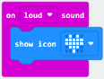 once;

Click the little triangle of “lond” to choose”quiet”;

Click the little triangle of “”
to choose””;

Complete Program：

Select“JavaScript" and“Python”to switch into JavaScript and Python language
code:

**( 4 )Test Results 1:**

After uploading test code to micro:bit main board V2 and powering the board via
the USB cable, the LED dot matrix displays pattern
“”when you claps and pattern
 when it is quiet around.

**( 5 )Test Code 2:**

Link computer with micro:bit board by micro USB cable, and program in MakeCode
editor,

Enter“Advanced”module→ choose“Serial”to find and drag“serial redirect to
USB”into “on start”block ;

Enter“Variables”module→ choose“Make a Variable”→ input “maxSound”→click
“OK”,variable ”maxSound”is established;

Enter“Variables”module to find and drag“set maxSound to 0”into “on start”block ;

Enter“Logic”module to find and drag“if true then...else”into “forever” block ;

Enter“Input”module to find and dragbutton A is pressed”into “then” ;

Enter“Basic”module to find and drag“show number”into “then” ;

Enter“Variables”module to find and drag“maxSound”into “0” ;

Establish variable“soundLevel”;

Enter“Variables”module to find and drag“set soundLevel to 0”into “else”;

Enter“Input”module to find and drag“sound level” into “0”;

Enter“Led”module to find and drag“plot bar graph of 0 up to 0” into “else”;

Enter“Variables”module to find and drag“soundLevel”into the“0”behind “of”;

Change the “0”behind “up” to “255”;

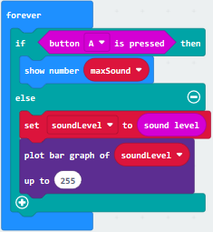

Enter“Logic”module to find and drag“if true then”into “else”block ;

Enter“Logic”module to find and drag“0 \> 0”into “then” ;

Enter“Variables”module to find and drag“soundLevel”into “0”on the left side of
“0-0” ;

Enter“Variables”module to find and drag“maxSound” into “0” on the right side;

Enter“Variables”module to find and drag“set maxSound to 0”into the second “then”
;

Enter“Variables”module to find and drag“soundLevel”into the “0” ;

Complete Program：

Select“JavaScript" and“Python”to switch into JavaScript and Python language
code:

**( 6 )Test Results 2:**

Upload test code to micro:bit main board V2, power the board via the USB cable
and click “Show console Device”as shown below.

When the sound is louder around, the sound value shows in the serial port is
bigger as shown below.

What’s more, when pressing the button A, the LED dot matrix displays the value
of the biggest volume( please note that the biggest volume can be reset via the
Reset button on the other side of the board ) while when clapping, the LED dot
matrix shows the pattern of the sound.

**Project 12: Bluetooth Wireless Communication**

**( 1 )Project Description:**

The Micro: Bit main board V2 comes with a nRF52833 processor (with a built-in
BLE(Bluetooth Low Energy) device Bluetooth 5.1 ) and a 2.4GHz antenna for
Bluetooth wireless communication and 2.4GHz wireless communication. With the
help of them, the board is able to communicate with a variety of Bluetooth
devices, including smart phones and tablets.

In this project, we mainly concentrate on the Bluetooth wireless communication
function of this main board. Linked with Bluetooth, it can transmit code or
signals. To this end, we should connect an Apple device (a phone or an iPad) to
the board.

Since setting up Android phones to achieve wireless transmission is similar to
that of Apple devices, no need to illustrate again.

**( 2 ) Preparation**

\*Attachment of Micro:bit main board V2 to your computer via the Micro USB
cable.

\*An Apple device (a phone or an iPad) or an Android device;

**( 3 ) Procedures:**

For Apple devices, enter this link
<https://www.microbit.org/get-started/user-guide/ble-ios/> with your computer
first, and then click “Download pairing HEX file”to download the Micro: Bit
firmware to a folder or desk, and upload the downloaded firmware to the Micro:
Bit main board V2

Search “micro bit”in your App Store to download the APP micro:bit.

Connect your Apple device with Micro: Bit main board V2:

Firstly, turn on the Bluetooth of your Apple device and open the APP micro:bit
to select item “Choose micro:bit”to start pairing Bluetooth.

Please make sure that the Micro: Bit main board V2 and your computer are still
linked via the USB cable.

Secondly, click“Pair a new micro:bit”;

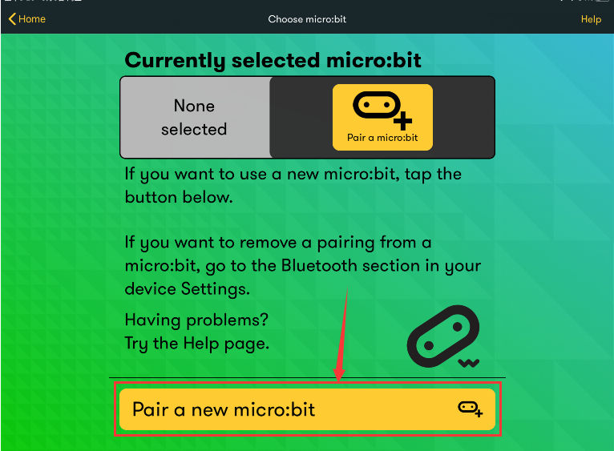

Following the instructions to press button A and B at the same time(do not
release them until you are told to) and press Reset & Power button for a few
seconds.

Release the Reset & Power button, you will see a password pattern shows on the
LED dot matrix. Now , release buttons A and B and click Next.

Set the password pattern on your Apple device as the same pattern showed on the
matrix and click Next.

Still click Next and a dialog box props up as shown below. Then click "Pair". A
few seconds later, the match is done and the LED dot matrix displays the "√"
pattern.

After the match with Bluetooth, write and upload code with the App.

Click “Create Code” to enter the programming page and write code.

Click  and the box
 appears, and then select “Create
√”.

Name the code as “1 “and click 
to save it.

Click the third item“Flash”to enter the uploading page. The default code program
for uploading is the one saved just now and named "1" and then click the other
"Flash" to upload the code program "1".

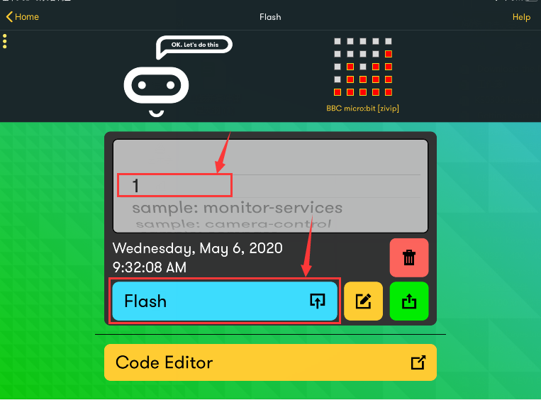

If the code is uploaded successfully a few seconds later, the App will emerge as
below and the LED dot matrix of the Micro: Bit main board V2 will exhibit a
heart pattern.

**6.Resources**

<https://fs.keyestudio.com/KS4017>

<https://makecode.microbit.org/>

<https://tech.microbit.org/hardware/>

<https://microbit.org/new-microbit/>

<https://www.microbit.org/get-started/user-guide/overview/>

<https://microbit.org/get-started/user-guide/features-in-depth/>

<https://tech.microbit.org/hardware/edgeconnector/>

<https://microbit.org/guide/hardware/pins/>

[https://microbit.org/guide/quick/](Https://microbit.org/guide/quick/)

<https://microbit.org/get-started/user-guide/mobile/>

<https://microbit.org/code/>

<https://microbit.org/projects/>
